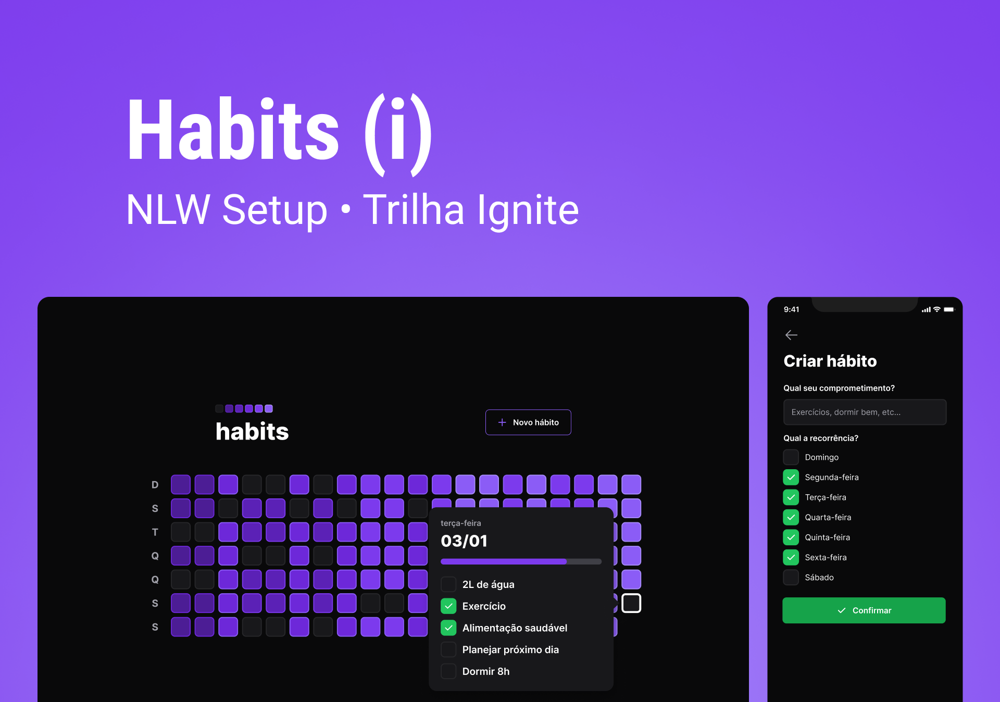

# NLW-setup-multi
<p align="center">
  
  
  
</p>




<br>
<br>

# Habito.io 😎
Try it out! [Habit.io](https://habitio.vercel.app) 
## 🧪 Technologies

This project was developed using the following technologies:

- [NodeJS](https://nodejs.org/)
- [TypeScript](https://www.typescriptlang.org/)
- [Fastify](https://www.fastify.io/)
- [Prisma](https://www.prisma.io/)
- [ViteJS](https://vitejs.dev/)
- [ReactJS](https://reactjs.org/)
- [TailwindCSS](https://tailwindcss.com/)
- [React Native](https://reactnative.dev/)
- [Expo](https://expo.io/)

Added to the original project:
  - [x] User capability (changing prisma db provider from sqlite to postgresql)
  - [x] Authentication with Firebase.
  - [Firebase](https://firebase.google.com/)
  
  - [x] API caching with Redis
  - [Redis](https://redis.io/)
  
  - [x] Full Stack management of api with Railway Deploy
  - [Railway](https://railway.app/)
  
  - [x] React Toasts to user feeback actions inside dashboard.
  - [React-Hot-toast](https://react-hot-toast.com/)
   
  - [x] Deploy on Vercel
  - [Vercel](https://vercel.com/)

## 🧪 SOLID

Principles:

- Single Responsibility Principle: Each class has a unique responsibility;
- Open/Closed Principle: Application classes must be open for extension but closed for modification;
- Liskov Substitution Principle: We should be able to replace a parent class with an inheritance from it and everything still works;
- Interface Segregation Principle: Segregate Interfaces;
- Dependency Inversion Principle: Instead of the class fetching the dependencies it needs, the context informs the class of the required dependencies;

## 🚀 Getting started

Clone the project and access the folder.

```bash
$ git clone https://github.com/arthurdias01/nlw-setup-multi.git
$ cd nlw-setup-multi
```

Follow the steps below:

### Web

```bash
# Install the web dependencies
$ cd web
$ npm install

# Start the web project
$ npm start
```

### Server

```bash
# Install the server dependencies
$ cd server
$ npm install

# Start the server project
$ npx prisma migrate deploy
$ npm run start:dev
```

### Mobile

```bash
# Install the mobile dependencies
$ cd mobile
$ npm install

# Start the mobile project
$ npm start
```

## 🔖 Layout

You can view the project layout through the links below:

- [Layout](<https://www.figma.com/file/pJpaMSKVfCmPUMZJOVwquQ/Habits-(i)-(Community)?node-id=6%3A344&t=1UcC6dIPVGBxdhpz-1>)

Remembering that you need to have a [Figma](http://figma.com/) account to access it.

---

Made with 💜 by [ArthurDias01](https://github.com/arthurdias01)👋
